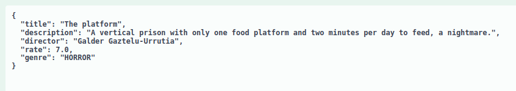

# Movie Catalog

<h1>Description</h1>

This project is design to practice my skills in Java, therefore it's a
simple database of movies.

<h2>Tools ⚙️</h2>
<ul>
<li>Java 17</li>
<li>Spring Boot</li>
<li>Gradle</li>
<li>MongoDB</li>
<li>Swagger</li>
</ul>
<h2>Functionalities</h2>
<ul>
<li>

searchMoviesByTitle() is a method to search a list of movies based in a title
that the user will write it.

 

User searches the following word: 

Then return the list of movies with the word "World":

</li>
 
<li>

addMovie() is a method to add a movie with a request which has the following
attributes: title, description, director, rate and genre.

 

Request example:

</li>
 
<li>

updateStreamAvailability() is a method to update the list of streams available 
to a certain movie, then the user will give the title of the movie and the stream available.

 

User writes title and stream that it wants to insert it: 

 

Then return the following response: 

</li>
</ul>

<h2>How it works?</h2>

Well, if you want  to see my project in your own machine, I'll
give you the path to follow.

<li>First step: You have to clone my project, and you need to have an 
IDE, I'm using IntelliJ</li>
<li>Second step: You need to have a MongoDB on your machine, you
can use the community one, here's the link: <a href="https://www.mongodb.com/docs/manual/administration/install-community/">Doc</a></li>
<li>Third step: You run the project on your IDE and start the
MongoDB on your machine, and then you go to your favorite browser and
type http://localhost:8080/swagger-ui/index.html#/</li>
<li>Fourth step: There you go, you can test my application.</li>